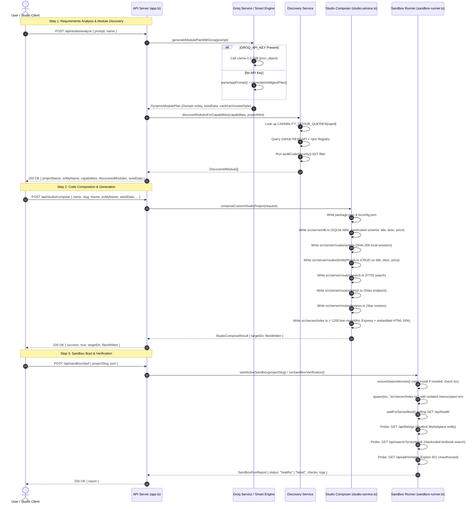
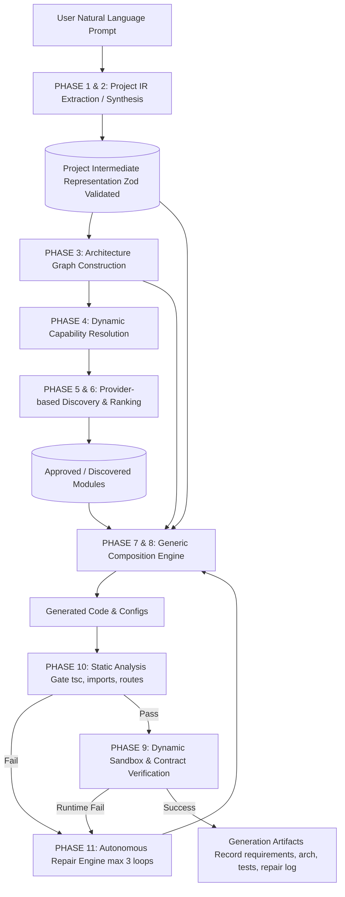

# FORGE V1 vs. V2 Generation Flow (Phase 0 Audit)

> Generated: 2026-10-03  
> Scope: End-to-end tracing of code generation, composition, and verification flows.

---

## 1. Current (V1) Generation Flow

The existing generation pipeline is divided across three main HTTP transactions:

---

## 2. Granular Flaws & Breakpoints in Current Flow

1. **Information Loss Between Analysis & Composition:**
   - In Step 1, the LLM produces `entityFields` (e.g. `[{"name": "fileUrl", "type": "string"}]`).
   - In Step 2, `StudioComposeRequest` completely drops `entityFields`! It only accepts `entityName`, `entityPlural`, and `seedData` where each record is forced into `{ title, description, price }`.
   - The rich entity schema returned by the LLM is thrown away.

2. **Template Monolith (Zero Architectural Flexibility):**
   - The file generator in `packages/api/src/studio-service.ts` uses static string interpolation into a predetermined Express structure.
   - It always outputs routes for `auth`, `search`, `admin`, and `reviews`.
   - If an application needs websockets, background task workers, asynchronous job queues, or file parsers, there is no mechanism to introduce those files or architectural layers.

3. **E-Commerce Bias in UI Generation:**
   - The generated `src/server/index.ts` embeds client-side Javascript featuring a cart drawer, star rating submission, and item purchase modals.
   - For an "AI Resume Analyzer", the resulting interface still renders "Add to Cart" and star rating cards.

4. **Brittle Verification Probes:**
   - `sandbox-runner.ts` tests `/api/listings` and `/api/search?q=textbook`.
   - When a project with entity `resume` is generated, `/api/listings` returns 404, and searching for `textbook` returns empty results or 404. The verification cannot validate whether `/api/resumes` or `/api/resumes/analyze` functions correctly.

5. **No Static Analysis or Pre-flight Checks:**
   - The generated code is launched directly with `tsx`. If there is a syntax error or missing module import (e.g. `TransformError` during esbuild/tsx compilation), the sandbox fails with a timeout or uncaught exception.
   - There is no TypeScript `tsc --noEmit` check, no import validator, and no schema consistency validator before execution.

6. **No Feedback or Repair Loop:**
   - If a sandbox fails to boot or a route probe fails, the system outputs an error and stops.
   - There is no diagnostic step, no identification of which component failed, and no automatic repair attempt.

---

## 3. Target (V2) Dynamic Generation Flow

The planned V2 pipeline replaces hardcoded templates and ad-hoc schemas with an authoritative **Project IR** and **Architecture Graph**:

---

## 4. Key Contracts for V2 Pipeline

1. **Input:** Natural Language Prompt.
2. **Intermediate Representation (IR):**
   - Formal schema for Project metadata, Entities & Fields, Features, Roles, Integrations, and Constraints.
3. **Architecture Graph:**
   - Nodes (Components, Services, Stores, Handlers, Clients).
   - Edges (Data dependencies, Control flow, API contracts).
4. **Composition Engine:**
   - Parameterized code generators driven by IR entities and graph nodes.
   - Independent of any specific domain model (neither e-commerce nor social network is hardcoded).
5. **Dynamic Verification Engine:**
   - Test suites synthesized directly from the Project IR's endpoints and features.
   - Verifies actual created entities and contracts (e.g. `POST /api/resumes`, `POST /api/resumes/:id/analyze`).
6. **Self-Healing Repair Engine:**
   - Inspects static analysis and runtime probe failures, isolates the faulty node in the Architecture Graph, generates an targeted fix, and re-verifies with bounded retries.
